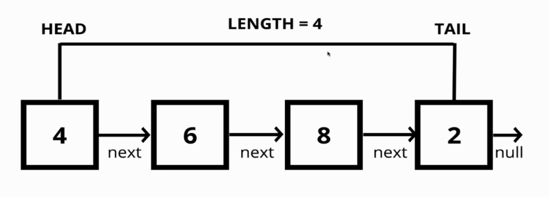

# Singly Linked List

> **Linked List** consists of bunch of elements with no indexes who are just pointing to the next element.

> Each element in a Linked List is a **Node**. **Node** stores a piece of data (string, number) but also a reference to next node or if element in the end it refers to `null`. So, Linked Lists consist of Nodes, and each node has a value and a pointer to another Node or `null` .

- we cannot grab some element with specific index, we just can get elements one-by-one.

**Linked List Data Structure contains 3 properties:** 

- **head** — beginning of the list
- **tail** — end of the list
- **length**

**Linked List** might have several methods:
1. `push` — add element to the end of the Linked List
2. `pop` — removing a Node from the end of the Linked List
3. `shift` — removing Node from the beginning of the Linked List
4. `unshift` — adding a new Node to the beginning of the Linked List
5. `get` — retrieving a Node by it's position in the Linked List
6. `set` — changing the value of a Node based on it's position in the Linked List.
7. `insert` — adding a Node to the Linked List at a specific position.
8. `remove` — removing a Node from the Linked List at a specific position

## Singly Linked List

- Each `Node` contained one link to `next` element

### 01. `push`

`push` — add element to the end of the Singly Linked List

- Accept a `value`
- Create a new `Node` using the `value` passed to the function
- If there is no `head` property on the list, set the `head` and `tail` to be the newly created one
- Otherwise set the `head`'s `next` property on the tail to be the new `Node` and set the `tail` property on the list to be the newly created one
- Increment the `length` by one
- Returned the linked list

### 02. `pop`

`pop` — removing a Node from the end of the Singly Linked List

To implement such behavior we need to go from all LinkedList element's to the end and change `tail` to be pre-`tail`.

- If there is no `Nodes` in the list, return `null`
- Loop through the list until reach the `tail`
- Set the `next` property of the 2nd to last `Node` to be `null`
- Set the `tail` to be the 2nd to last `Node`
- Decrement the length of the list by `1`
- Return the `value` of the `Node` removed
- If there are no elements in list `head` and `tail` must be equal to `null`

### 03. `shift`

`shift` — removing Node from the beginning of the Linked List

- If there are no `Node`s, return `undefined`
- Store the current `head` property in a variable
- Set the `head` property to be the current `head`'s `next` property
- Decrement the `length` by 1
- Return the value of the Node removed

### 04. `unshift`

`unshift` — adding a new Node to the beginning of the Linked List

- Should accept a `value`
- Create a new `Node` using the `value` passed to the function
- If there is no `head` property on the list, set the `head` and `tail` to be the newly created node
- Otherwise set the newly created node's `next` property to be the current `head` property on the list
- Set the `head` property on the list to be that newly created Node
- Increment the `length` of the list by `1`
- Return the Linked List

### 05. `get`

`get` — retrieving a `Node` by it's position in the Linked List

- This function should accept an `index`
- If the index is less than zero or greater than or equal to the `length` of the list, return `null`
- Loop through the list until you reach the `index` and return the Node at that specific `index`

### 06. `set`

`set` — changing the `value` of a `Node` based on it's position in the Linked List.

- This function should accept a `value` and an `index`
- Use your `get` function to find the specific Node
    - If the Node is not found, return `false`
    - If the Node is found, set the `value` of that Node to be the `value` passed to the function and return `true`
    
### 07. `insert`

`insert` — adding a Node to the Linked List at a specific position.

- Accept a `value` and an `index`
- If the `index` is less than zero or greater than the `length`, return `false`
- If the `index` is the same as the `length`, push a new Node to the end of the list
- If the `index` is `0` , `unshift` a new Node to the start of the list
- Otherwise, using the `get` method, access the Node at the `index - 1`
    - Set the `next` property on that Node to be the new Node
    - Set the `next` property on the `new` node to be the previous `next`
- Increment the `length`
- Return `true`

### 08. `remove`

`remove` — removing a Node from the Linked List at a specific position

- Accepts an `index`
- If the `index` is less than zero or greater than the `length`, return `undefined`
- If the `index` is the same as the `length - 1`, `pop`
  - If the `index` is `0`, `shift`
  - Otherwise, using `get` method, access the Node at the `index - 1`
  - Set the `next` property on that Node to be the `next` of the next Node
  - Decrement the `length`
  - Return the `value` of the Node removed

### 09. `reverse`

`reverse` — reversing the Linked List in place. That's mean that you are not make a copy. So, you should reverse Linked List as you go through it — traverse and reverse.

- Swap the `head` and `tail`
- Create a variable called `next`
- Create a variable called `prev`
- Create a variable called `node` and initialize it to the `head` property
- Loop through the list
    - Set `next` to be the `next` property on whatever node is
    - Set the `next` property on the node to be whatever `prev` is
    - Set `prev` to be the `value` of the `node` variable
    - Set the `node` variable to be the `value` of the next variable
