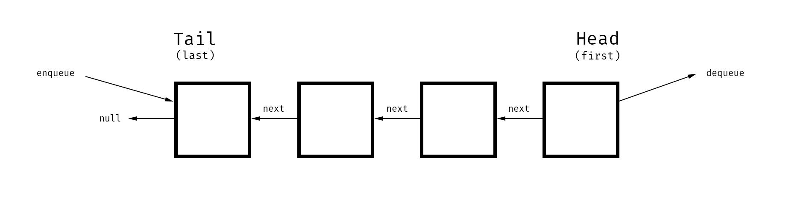

# Queue

---

> **Queue** is a sequential collection where elements are added at one end and removed from the other end.

### Important facts:

- Modeled after a real-life queue: first come, first served.
- First in, first out (FIFO) data structure.
- Similar to a linked list, the first (last added) node is called the *tail*, and the last (next to be removed) node is called the head.
- Two fundamental operations are *enqueuing* and *dequeuing*:
    - To *enqueue*, insert at the tail of the linked list.
    - To *dequeue*, remove at the head of the linked list.
- Usually implemented on top of linked lists because they're optimized for insertion and deletion, which are used to enqueue and dequeue elements.

### Pros:

- Constant-time insertion and deletion.

### Cons:

- Access and search are `O(n)`.

### Notable uses:

- CPU and disk scheduling, interrupt handling and buffering.
- making order from stream of users trying to connect to server
- background tasks
- Print Queue / Task Processing — printer will only handle one file at time

## Queue implementation details

**Queue** might have several properties:

- `first` — pointer to the Head of the Stack
- `last` — pointer to the Tail of the Stack
- `size` — the size of the Stack

**Queue** might have several methods:

- `enqueue` — adds node to the Tail of the Queue
- `dequeue` — removes node from the Head of the Queue

## Time complexity (worst case):

- Access: `O(n)`
- Search: `O(n)`
- Insertion (enqueuing): `O(1)`
- Deletion (dequeuing): `O(1)`