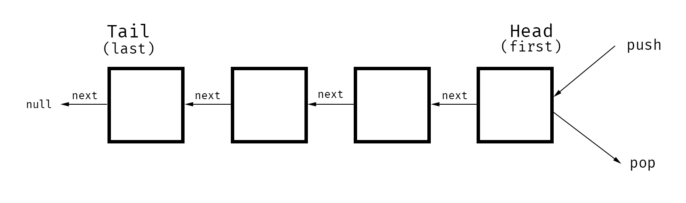

# Stack

---

> **Stack** is  a sequential collection where elements are added to and removed from the same end.

### Important facts
- First-in, last-out (FILO) data structure.
- Equivalent of a real-life pile of papers on desk.
- In stack terms, to insert is to *push*, and to remove is to *pop*.
- Often *implemented on top of a linked list* where the head is used for both insertion and removal. Can also be implemented using *dynamic arrays*.

### Pros:

- Fast insertions and deletions: `O(1)`.

### Cons:

- Access and search are `O(n)`.

### Notable uses:

- History: maintaining undo history.
- Managing functions invocation: Tracking execution of program functions via a call stack.
- Reversing order of items.
- Undo/Redo functionality.
- Routing (using `history` object)

## Stack implementation details

**Stack** might have several properties:

- `first` — pointer to the Head of the Stack
- `last` — pointer to the Tail of the Stack
- `size` — the size of the Stack

**Stack** might have several methods:

- `push` — adds node to the head of the Stack
- `pop` — removes node from the head of the Stack

Using *linked list* approach, both `push` and `pop` methods reflects so-called methods of *linked list*.

### `push` method

`push` method should add new Node to the Head of the Stack

- The function should accept a `value`
- Create a new Node with that `value`
- If there are no Nodes in the Stack, set the first and last property to be newly created node
- If there is at least one Node, create a variable that stores the current first property on the stack
- Reset the first property to be the newly created Node
- Set the next property on the Node to be the previous created variable
- Increment the size of the Stack by `1`

### `pop` method

`pop` method should remove Node from the Head of the Stack

- If there are no Nodes in the Stack, return `null`
- Create a temporary variable to store the first property on the Stack
- If there is only 1 Node, set the first and last property to be `null`
- If there is more than one Node, set the first property to be the next property on the current first
- Decrement the size by `1`
- Return the `value` of the Node removed

## Time complexity (worst case):
- Access: `O(n)`
- Search: `O(n)`
- Insertion (pushing): `O(1)`
- Deletion (popping): `O(1)`